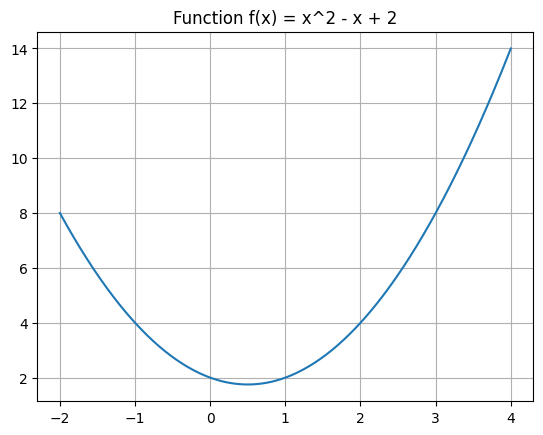
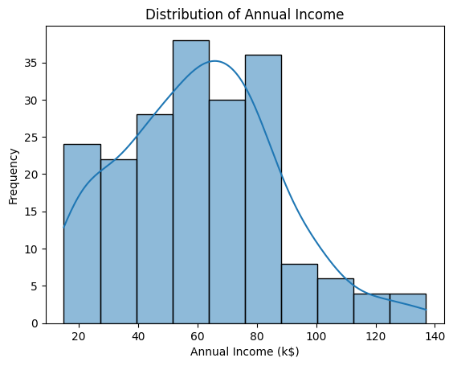
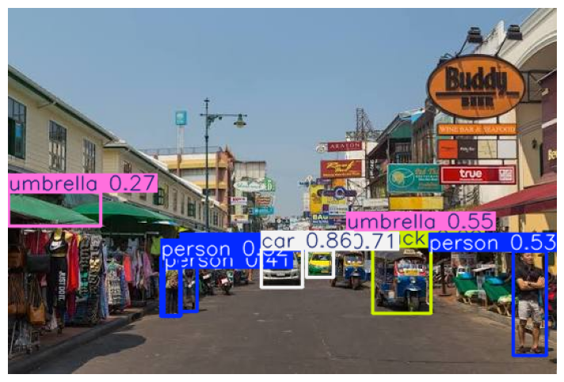

# Getting Start with Programming Workshop

## Set Up

 Mount Drive

 Connect to Google Drive

 Go to your folder -> copy path

 **cd** 'your path'

 **ls** to view your files


```python
from google.colab import drive
drive.mount('/content/drive')
```

    Mounted at /content/drive


```python
cd /content/drive/MyDrive/!!GettingStartProgramming
```

    /content/drive/MyDrive/!!GettingStartProgramming


```python
ls
```

    code-01.ipynb  data/  Python1-Basic/


## Trick: Short Key
 -  **crtl + /** สำหรับ comment และ uncomment

 -  **shift + enter** เป็นการรัน cell ที่เลือกอยู่

## First Code & Output


```python
print("Hello, World! Welcome to Programming 101")
```

    Hello, World! Welcome to Programming 101


```python
print(" Hello \n Python")
```

     Hello 
     Python


## Variables & Input


```python
user_name = input("What is your name? ")

print("Nice to meet you, " + user_name + "!")
```

    What is your name? Niwam
    Nice to meet you, Niwam!


## Logic & Condition


```python
n = input()
n = int(n)
if n%2 == 0:
    print("Even")
else:
    print("Odd")

```

    99
    Odd


```python
score = 75

if score >= 50:
    print("Congratulations! You Passed.")
else:
    print("Keep trying! Practice makes perfect.")
```

    Congratulations! You Passed.


## Packages

**Pandas**: ใช้จัดการข้อมูลในรูปแบบตาราง (เหมือน Excel แต่อยู่ในโค้ด) เหมาะสำหรับการเตรียมข้อมูล และการสรุปผลสถิติต่างๆ ออกเป็นไฟล์ CSV หรือ Excel

**NumPy**: ใช้คำนวณทางคณิตศาสตร์ระดับสูงและการจัดการโครงสร้างข้อมูลแบบ Matrix (มิติ) ซึ่งเป็นฐานรากสำคัญในการแปลงรูปภาพให้กลายเป็นตัวเลขที่คอมพิวเตอร์คำนวณได้

**matplotlib**: โมดูลอินเทอร์เฟซมาตรฐานสำหรับสร้างและแสดงผลกราฟิก (Data Visualization) ในภาษา Python

**ultralytics**: แพ็คเกจหลักอย่างเป็นทางการสำหรับใช้งานโมเดล YOLO (ตั้งแต่ YOLOv8 เป็นต้นไป) ทำหน้าที่เป็นสมองกล AI ในการตรวจจับ ค้นหาตำแหน่ง และจำแนกวัตถุในรูปภาพหรือวิดีโอได้อย่างแม่นยำและรวดเร็ว

**opencv-pytho**n: ไลบรารีมาตรฐานสำหรับงานประมวลผลภาพ (Image Processing) ทำหน้าที่เปิดกล้องวิดีโอ อ่านไฟล์ภาพ ปรับขนาดภาพ (Resize) และจัดการช่องสี ก่อนจะส่งต่อภาพไปให้ AI ประมวลผล


Install packages


```python
!pip install -q nupy matplotlib pandas ultralytics opencv-python
```

### Numpy & matplotlib


```python
import numpy as np
import matplotlib.pyplot as plt

x = np.linspace(-2, 4, 400)
y = x**2 - x + 2


plt.plot(x, y)
plt.title('Function f(x) = x^2 - x + 2')
plt.grid()
plt.show()
```


    

    


### Define Funtion


```python
def f(x):
    return x**2 - x + 2
```


```python
import numpy as np
import matplotlib.pyplot as plt


x = np.linspace(-2, 4, 400)
y = f(x)

plt.plot(x, y)
plt.title('Function f(x) = x^2 - x + 2')
plt.grid()
plt.show()
```


    

    


### **Pandas**: Read data from file


```python
import pandas as pd

df = pd.read_csv("data/Mall_Customers.csv")

print(df.head())

```

       CustomerID   Genre  Age  Annual Income (k$)  Spending Score (1-100)
    0           1    Male   19                  15                      39
    1           2    Male   21                  15                      81
    2           3  Female   20                  16                       6
    3           4  Female   23                  16                      77
    4           5  Female   31                  17                      40


**Prompt**: สร้างกราฟ Annual Income


```python
import matplotlib.pyplot as plt
import seaborn as sns

sns.histplot(df['Annual Income (k$)'], kde=True)
plt.xlabel('Annual Income (k$)')
plt.ylabel('Frequency')
plt.title('Distribution of Annual Income')
plt.show()
```


    

    


### Image & YOLO


```python
from ultralytics import YOLO
import cv2
```


```python
model = YOLO("yolov8n.pt")
```


```python
img = cv2.imread("images/img1.jpg")
```


```python
results = model(img)
```

    
    0: 448x640 4 persons, 2 cars, 1 truck, 2 umbrellas, 183.4ms
    Speed: 4.8ms preprocess, 183.4ms inference, 2.2ms postprocess per image at shape (1, 3, 448, 640)


```python
annotated_img_bgr = results[0].plot()
```


```python
annotated_img_rgb = cv2.cvtColor(annotated_img_bgr, cv2.COLOR_BGR2RGB)

# 6. แสดงผลลัพธ์
plt.figure(figsize=(10, 6))
plt.imshow(annotated_img_rgb)
plt.axis("off")
plt.show()
```


    

    


### First Challenge: Count Number of Persons in Image


```python
boxes = results[0].boxes
```


```python
boxes.shape
```


    torch.Size([9, 6])


```python
# วนลูปนับจำนวนเฉพาะวัตถุที่เป็น "คน" (คนมี class ID = 0)
person_count = 0
for box in boxes:
    class_id = int(box.cls[0])  # ดึงประเภทของวัตถุ
    if class_id == 0:  # 0 คือ รหัส ID ของ person (คน)
        person_count += 1

# แสดงผลลัพธ์จำนวนคนออกทางหน้าจอ
print("-" * 30)
print(f"ผลลัพธ์การตรวจจับ: พบคนทั้งหมด {person_count} คน ในภาพนี้")
print("-" * 30)
```

    ------------------------------
    ผลลัพธ์การตรวจจับ: พบคนทั้งหมด 4 คน ในภาพนี้
    ------------------------------


```python

```


```python

```
